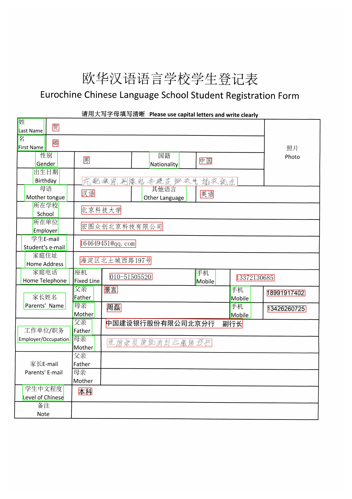

# Synthesis multilingual handwritten text data
Detecting multilingual handwritten texts in the document is demanding due to the lack of training data. Therefore, we designed a simple yet effective method focused on multilingual handwritten text dataset generation that is beneficial for handwritten text detection and segmentation.

## Visulization results

